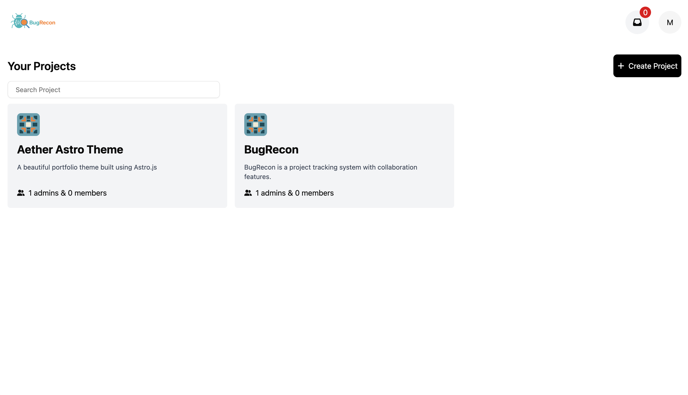
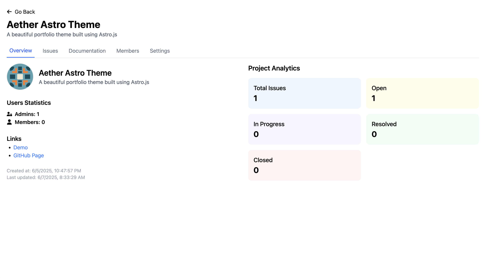
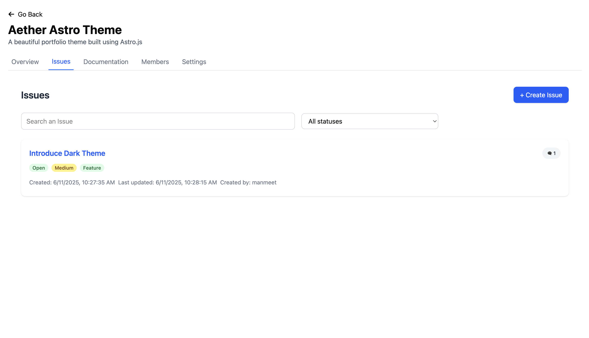
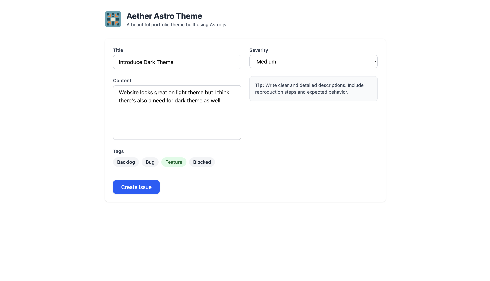
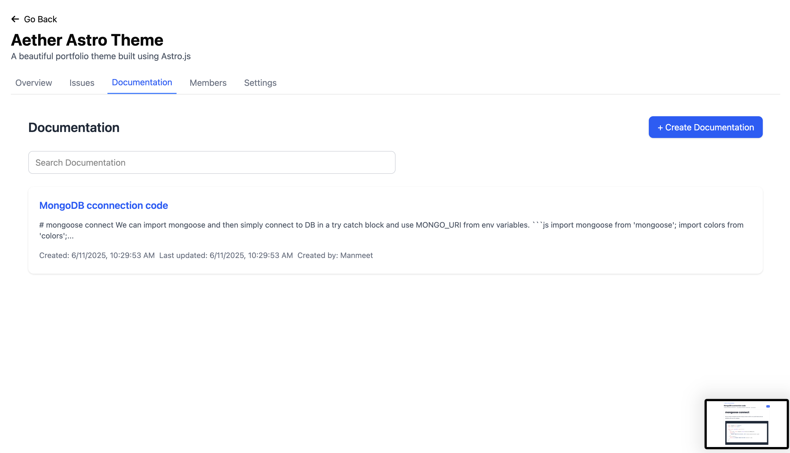
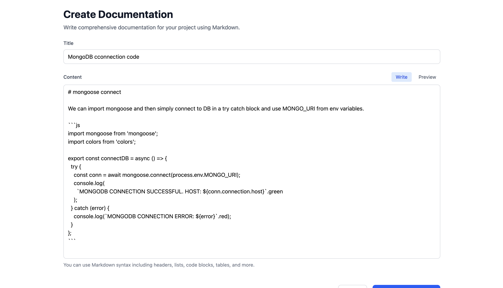
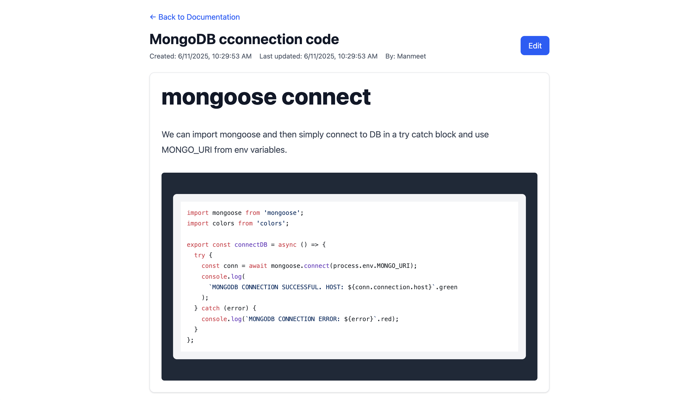
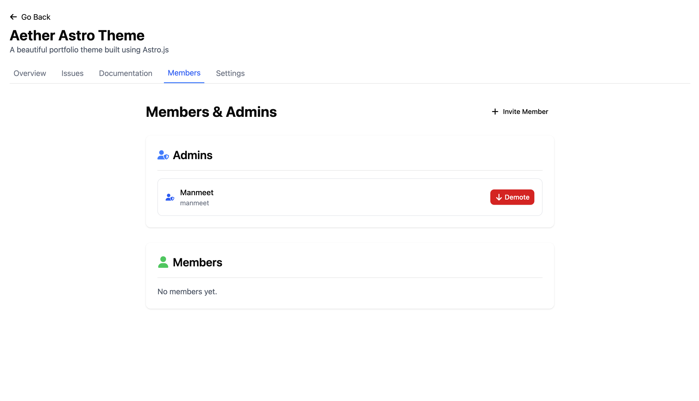
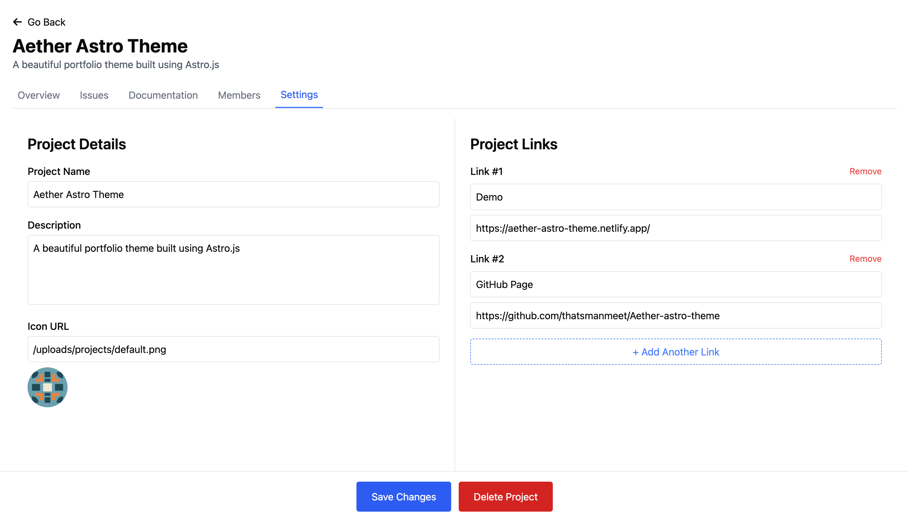

# 🐞 BugRecon

**BugRecon** is a lightweight yet powerful project management tool built to simplify the process of tracking issues, collaborating with team members, and maintaining documentation — all in one place.

---

## 📝 Problem Statement

Whenever I built projects, it was hard to track down the bugs and features I was working on. Taking notes of the things I learned required a separate app, which became too distracting and fragmented my workflow. To solve these challenges, I built BugRecon to bring issue tracking, collaboration, and documentation together in one unified platform.

---

## 🚀 Features

* **Project & Issue Tracking**
  Create, manage, and resolve issues tied to specific projects. Keep your workflow structured and efficient.

* **Team Collaboration**
  Add team members to your projects and collaborate on tasks in real-time. Assign issues, leave comments, and track progress.

* **Documentation Management**
  Keep important notes, references, and future plans organized with built-in documentation support.

* **Clean & Intuitive UI**
  Navigate through a modern interface designed for productivity and ease of use.

* **Role-Based Access Control**
  Manage user permissions to ensure the right people have the right access to your projects.

---

## 💻 Tech Stack

* **Frontend**: React, Tailwind CSS
* **Backend**: Node.js, Express
* **Database**: MongoDB
* **Authentication**: JWT-based secure login system

---

## ⚙️ Environment Variables

Rename `.env.sample` to `.env` inside your `backend/` directory and fill in the following fields:

```
NODE_ENV=production
PORT=8002
CORS_ORIGIN=*
MONGO_URI=<MONGODB URL>
ACCESS_TOKEN_SECRET=<your access token secret>
ACCESS_TOKEN_EXPIRY=1d
REFRESH_TOKEN_SECRET=<your refresh token secret>
REFRESH_TOKEN_EXPIRY=30d
RATE_LIMIT_REQUEST=100
MAILTRAP_HOST=sandbox.smtp.mailtrap.io
MAILTRAP_PORT=2525
MAILTRAP_USER=your_username
MAILTRAP_PASS=your_password
```

✅ **Note:** Keep this file secret — never commit it to version control.

---

### 🔑 Generate Secure JWT Secrets

```bash
# Generate a secret between 32 and 65 bytes long:
node -e "console.log(require('crypto').randomBytes(48).toString('hex'))"
```

Paste the generated string into `ACCESS_TOKEN_SECRET` and `REFRESH_TOKEN_SECRET` for signing your JWTs.

---

## 📦 Installation

### 1. Clone the Repository

```bash
git clone https://github.com/thatsmanmeet/bugrecon.git
cd bugrecon
```

### 2. Install Dependencies & Run

Ensure your `.env` is configured and then run:

```bash
npm run build
npm run dev
```

> 🌐 Backend: `http://localhost:8002`
> 🌐 Frontend: `http://localhost:5173`

### ⚙️ Production

```bash
npm run build
npm run server
```

---

## 📸 Screenshots

| Home Page | Overview Page |
|:--------------------|:----------------|
|  |  |

| Issues Page | Create Issue |
|:--------------------|:----------------|
|  |  |

| view issue | Documentation Page |
|:--------------------|:----------------|
|  |  |

| create Documentation | View Documentation |
|:--------------------|:----------------|
|  |  |

| Members Page | Settings Page |
|:--------------------|:----------------|
|  |  |

---

## 📄 License

```
MIT License

Copyright (c) 2025 Manmeet Singh

Permission is hereby granted, free of charge, to any person obtaining a copy
of this software and associated documentation files (the "Software"), to deal
in the Software without restriction, including without limitation the rights
to use, copy, modify, merge, publish, distribute, sublicense, and/or sell
copies of the Software, and to permit persons to whom the Software is
furnished to do so, subject to the following conditions:

The above copyright notice and this permission notice shall be included in all
copies or substantial portions of the Software.

THE SOFTWARE IS PROVIDED "AS IS", WITHOUT WARRANTY OF ANY KIND, EXPRESS OR
IMPLIED, INCLUDING BUT NOT LIMITED TO THE WARRANTIES OF MERCHANTABILITY,
FITNESS FOR A PARTICULAR PURPOSE AND NONINFRINGEMENT. IN NO EVENT SHALL THE
AUTHORS OR COPYRIGHT HOLDERS BE LIABLE FOR ANY CLAIM, DAMAGES OR OTHER
LIABILITY, WHETHER IN AN ACTION OF CONTRACT, TORT OR OTHERWISE, ARISING FROM,
OUT OF OR IN CONNECTION WITH THE SOFTWARE OR THE USE OR OTHER DEALINGS IN THE
SOFTWARE.
```

✨ *A Project By Manmeet Singh*
